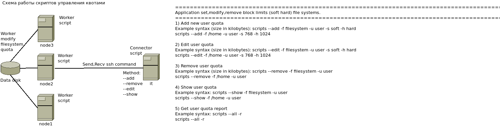

### <b> About project </b>
    This project provides fault-tolerant NSF service from two or more cluster nodes with one floating IP address.
    Quota management is shown in the diagram

### <b> Functions</b>
    In developing    
### <b> Install </b>
    In developing
### <b> Configure </b>
    In developing
